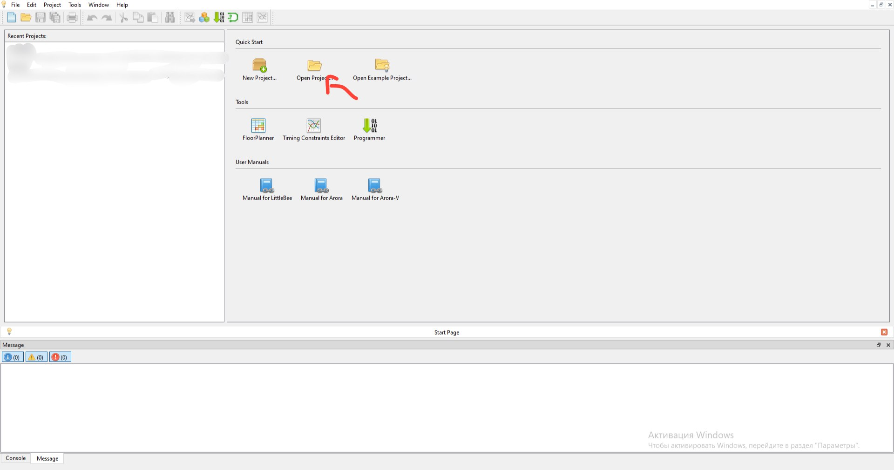

# Welcome to the official documentation of the Amalthea processor architecture. Here, you can learn more about our architecture and even acquire new skills.

## Quick start:
1. Purchase or receive the KiG TN P0/1 processor by mail, or buy the Tang Nano 9k FPGA (which will be much more complicated), and then connect the board/processor to your computer via USB-C.

2. Install Gowin EDA from the official website (www.gowinsemi.com). including all drivers offered by the downloader (required). After installation, a program shortcut will appear on your desktop - double-click on it.

3. Now you must download the official CPU architecture archive. It is available in our Telegram channel or at the link: (https://github.com/Kig-Organization/Amalthea-Archive.git).

4. Open Gowin EDA and in the Quick Start window, double-click on Open Project and select the archive folder.

5. Now you are in the project window. In the top panel, select Run Synthesis, followed by Run Place & Route. and after these actions, in the same panel, click on Programmer from the back of Run Synthesis.

(Gowin EDA will automatically detect your device). In Frequency, select 15 MHz and click Save.
After these actions, in the top panel of Programmer, select Program/Configure, and after a few seconds, the bitstream architecture will be loaded into your board/processor! 
If everything went well, the third and bottom LEDs should light up on your board:

(In some cases, only the 3rd diode lights up, which is completely normal if it doesn't flash and no errors occur during flashing. Ignore this)

